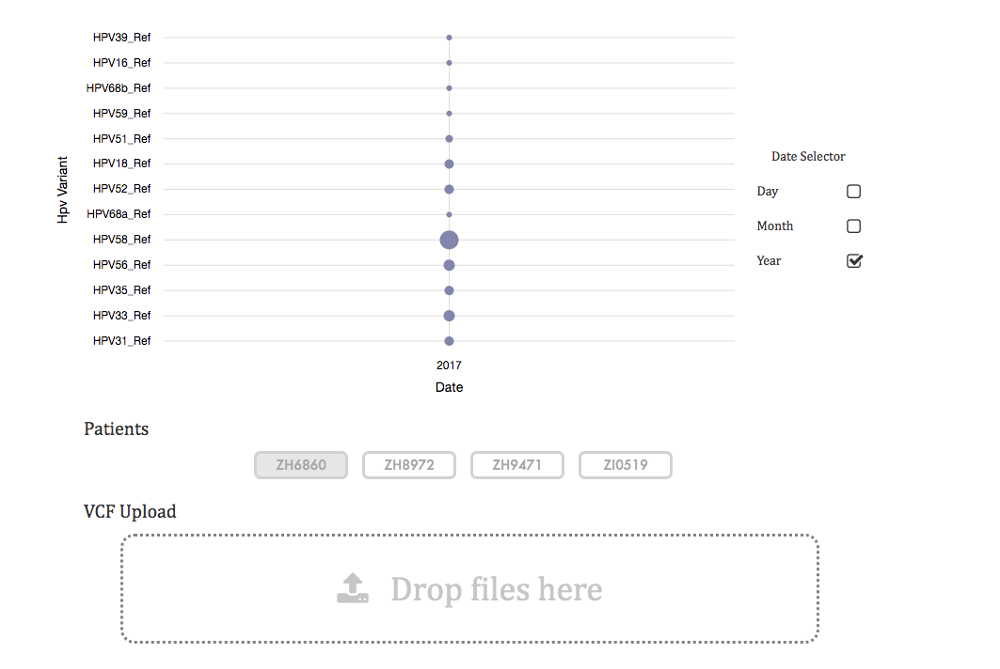

# VCF Visualization
## Overview
Visualization of uploaded VCF files used to show variant change over time. This is can be useful when observing a viral genome (e.g. HPV) that may record variant types & sublineages that are drastically different in between recorded times.

## Development
```
$ git clone https://github.com/DavidStreid/hpv-viz.git
$ npm install
$ npm run start # App should now be started at localhost:4200
```

## Technologies
This uses the ngx-charts library.

## Demo
To check out this project, check out http://davidstreid.com/#/data/vcf

